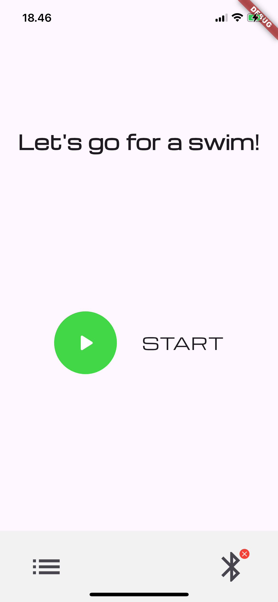
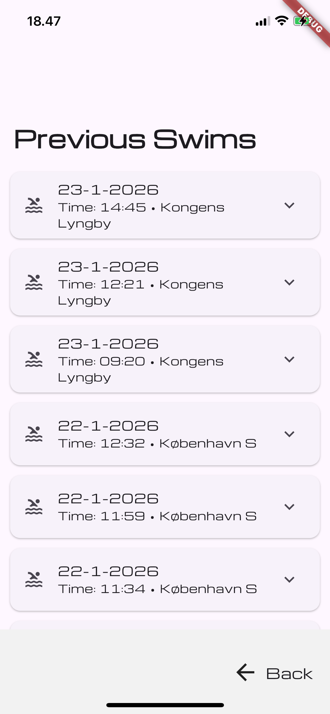
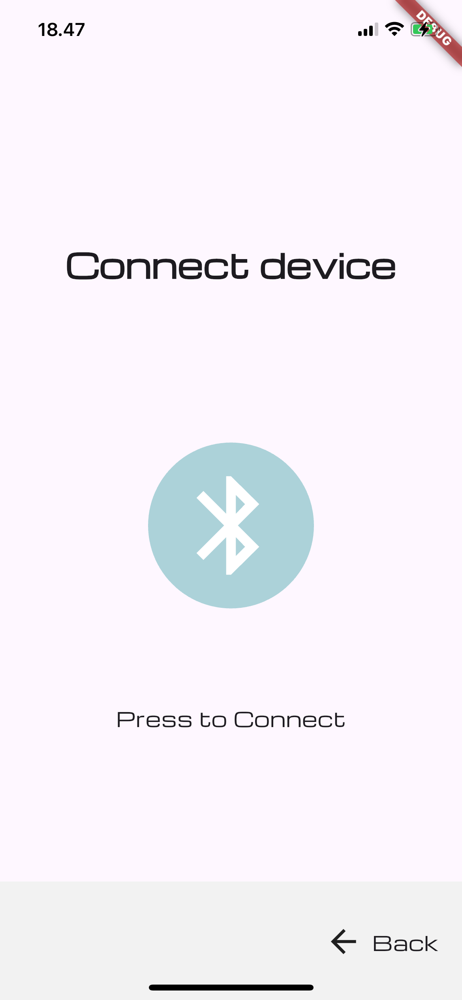
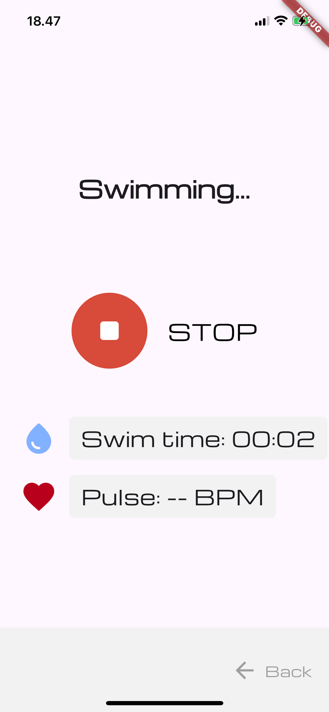

# Mobile-Health-Application---Heart-Rate-Measurements-During-Cold-Water-Immersion

A Flutter app for tracking swimming sessions using a Movesense device.
Swim sessions are stored locally and can be viewed later.

---

## Overview

The app consists of the following main views:
- Home view
- During swim view
- History view
- Connect view

---

## Screenshots

  
  
  
  

---

## App Flow

1. Connect View
   - User presses Bluetooth_Connect
   - Connection is established using UUID and MDS_flutter_plus plugin

2. Home View
   - User presses START
   - Transitions to "During Swim View"
   - A new BathingEvent is instantiated with the current time

3. During Swim View
   - Live heart rate is shown using a stream
   - User presses STOP
   - The BathingEvent is saved to the local database (Sembast)
   - User can navigate back to Home

4. History View
   - Loads BathingEvents from the database
   - Displays swim times in a list

---

## Persistence

The app uses Sembast as a local database.

- The database instance is stored in Block
- Swim sessions are stored in the "bathing_events" store
- DateTimes are saved as UTC ISO 8601 strings
- Database is stored localy on iphone at address /var/mobile/Containers/Data/Application/"your_specific_UUID"/Documents/

---

## Architecture

- Block
  Creates the models

- ViewModels
  Communication between views and models

- Views
  Handle UI and navigation

- Models
  Holds long-lived services

---

## How to setup App.

- To connect you must use a personal UUID/BlueTooth address this needs to be changed in the [Movesense device manager](flutter_application/lib/model/movesense_device_manager.dart)
- The App has not been testet on Android but in theory a BlueTooth address should work for that system. Use UUID for Iphone.
- To add weather data from: https://home.openweathermap.org one needs to go to this website and generate a free API key. This can then be inserted in [main](flutter_application/lib/main.dart).
- Also to get all location/bluetooth data, these need to be permitted, which is automatically initiated on the apps first startup.

---

## Further information

for further information please see our [overleaf_project](overleaf_project/mHealth_projekt.pdf)